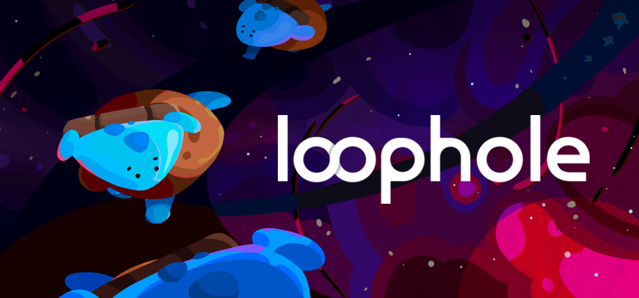

<p align="center">
  
</p>

<h1 align="center">The Loophole Level Editor</h1>

<p align="center">
  A web-based, open-source level editor for <a href="https://store.steampowered.com/app/3629400/Loophole/">Loophole</a>, the time-bending puzzle game about working with - and against - your past selves.
</p>

<p align="center">
  
  
  
  
</p>

## About the Level Editor

This repo contains the full source code for Loophole's level editor. It allows you to build individual game levels in your browser, with access to (almost) every available in-game object.

The editor is hosted on [GitHub Pages](https://loophole-game.github.io/loophole-level-editor/), and this repository is the source for both the app and the underlying engine/editor logic.

### Note: game not included

This project is just the editor, not the full game! To actually playtest your levels and publish them to the community, you’ll need your own copy of [Loophole on Steam!](https://store.steampowered.com/app/3629400/Loophole/)

## Local Development

This project uses **pnpm**.

```bash
pnpm install
pnpm dev
```

Other useful scripts:

```bash
pnpm build
pnpm lint
pnpm type-check
```

## How it works (under the hood)

The editor is built with **React + TypeScript + Vite**, but most of the "editor feel" comes from a custom canvas engine and an editor layer on top:

- **Engine core** (`src/utils/engine/`):
    - ECS-ish structure (entities + components + systems)
      - **Entities** are the individual game objects that exist in the world.
      - **Components** are behaviors attached to entities, often used for 
      - **Systems** handle top-level engine functionality, like rendering, user-input, and debugging.
    - Everything draws to a shared `<canvas>`
- **Loophole editor layer** (`src/utils/levelEditor/`):
    - `LevelEditor` is the source of truth for the current level, placement constraints, and undo/redo
    - Scenes/entities map Loophole level data into engine visuals (tiles, highlights, UI overlays)
- **React UI + state**:
    - Panels/tooling live in `src/components/LevelEditor/`
    - Shared state is wired via stores in `src/utils/stores.ts`

If you’re looking to find where specific features live:

- **Input, camera, rendering** → `src/utils/engine/systems/`
- **Grid + tile visuals** → `src/utils/levelEditor/scenes/`
- **Rules, schema sync, undo/redo** → `src/utils/levelEditor/index.ts`


## FAQ

- Q: Why isn't this an in-game level editor?
  - A: Because we had to build it from scratch, and it was easier to build in web than in Unity. Our internal level was built using Unity's Editor UI, so almost none of that code could be reused for a public-facing editor. At that point, we might as well pick the tool that's best for the job.
- Q: Why is this like this? *gestures at bad code*
  - A: Open a PR/Issue! We are very open for community contributions that improve the editor's existing functionality and performance. 
  - We are not, however, looking to add new mechanics that don't exist already in the game.
- Q: Why not use an existing game engine? Ex: Phaser, Construct, Godot
  - A: Because it's fun to build cool things! @wakeupinagear (the editor's lead dev) likes custom engines and had been meaning to make a web one for a while, so this was an excuse to do so.